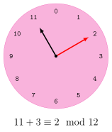
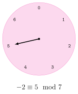
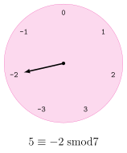
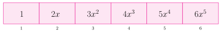
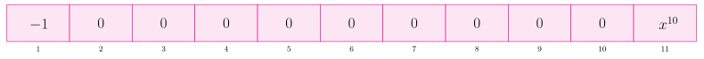
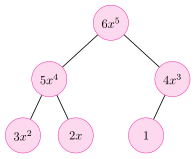
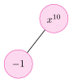

<style>
.theorem {
    margin-top: 0.25em;
    margin-bottom: 0.25em;
}

.theorem-title {
    display: block;
    font-size: 1.05em;
    font-weight: 400;
    margin-bottom: 0.5em;
    color: #51247A;
}

/* Different colours by environment */
.theorem.theorem .theorem-title { color: #A32638; }
.theorem.definition .theorem-title { color: #3333B2; }
.theorem.example .theorem-title { 
    color: #007A5E; 
    font-weight: 400;
}
.theorem.lemma .theorem-title      { color: #B45F06; }
.theorem.proposition .theorem-title { color: #A32638; }

.theorem-title * {
    font-weight: inherit !important;
}

.theorem.example:has(> p:first-child + ol) > p:first-child .theorem-title,
.theorem.example:has(> p:first-child + ul) > p:first-child .theorem-title {
    display: inline !important;
}
</style>


<!-- LaTeX Macros -->
\newcommand{\ring}{\mathcal{R}}
\newcommand{\RR}{\mathbb{R}}
\newcommand{\ZZ}{\mathbb{Z}}
\newcommand{\NN}{\mathbb{N}}
\newcommand{\QQ}{\mathbb{Q}}
\newcommand{\FF}{\mathbb{F}}
\newcommand{\abs}[1]{\left|#1\right|}
\newcommand{\PP}{\mathbb{P}}
\renewcommand{\cong}{\equiv}
\renewcommand{\mod}{\bmod}
\renewcommand{\mod}{\bmod}
\newcommand{\content}{\mathop{\mathrm{cont}}\nolimits}
\newcommand{\primpart}{\mathop{\mathrm{primpart}}\nolimits}
\newcommand{\lc}{\mathop{\mathrm{lc}}\nolimits}
\newcommand{\lt}{\mathop{\mathrm{lt}}\nolimits}
\newcommand{\lm}{\mathop{\mathrm{lm}}\nolimits}

# Project Preliminaries
```{julia}
#| echo: false
path_to_project_dir = "../../MATH2504_2026_ProjectB";
```
Clone the repository using the instructions from Project B assignment specification.

Assuming `project_to_project_dir` is the path to `MATH2504_2026_ProjectB` then the code base is initialized by doing.
```{julia}
#| output: false
Pkg.develop(path = path_to_project_dir)
using PolynomialAlgebra
```

Now we have access to basic polynomials and algebraic operations acting on polynomials that are used throughout these notes.
```{julia}
x = x_poly(PolynomialDense{Int64})
z = zero(PolynomialDense{Int64})
p = (3x^2-x)*x
```


# Symbolic Versus Numeric Computation

Numerical computation is fast, well understood, and typically sufficient. NASA requires only *15 digits* of $\pi$ for interplanetary exploration and *39 digits* is adequate to estimate the volume of the known universe accurate to within a hydrogen nucleus.

Nonetheless, to write $\sqrt{2}$ as a decimal requires infinitely many digits whereas computer memory is finite. Thereby any numerical/float/machine representation of $\sqrt{2}$ is necessarily off by some error $\varepsilon > 0$.

::: {#exm-numerical-instability}
$$
\begin{aligned}
\sqrt{2}_{10} &= 1.414213562
&& (\sqrt{2}_{10})^2 = 1.999999999 \\
\sqrt{2}_{15} &= 1.41421356237310
&& (\sqrt{2}_{15})^2 = 2.00000000000001
\end{aligned}
$$
:::

This error is not necessarily a problem in isolation.  The problem is that a computation usually involves a sequence of arithmetic operations, each of which can propagate or amplify the error.

For example, *adding* the inexact numbers $x$ and $y$ *doubles* the inexactness
$$(x \pm \varepsilon) - (y \pm \varepsilon) = (x-y) \pm 2\varepsilon.$$
This is catastrophic for common algorithms like Gaussian elimination because when we require $x -y = 0$ we actually get $x -y = 2\varepsilon$. **Numerical instability**, left unchecked, will produce nonsense answers (like a lower triangular matrix with no zeros).

In *symbolic computation* there is no numerical instability because all values are represented *exactly*.  Any computer algebra system will accommodate
arbitrarily large integers, fractions (e.g., $\frac{1}{3}$ not $0.333\ldots$), and *arithmetic on polynomials*.  This final inclusion is significant because having polynomial arithmetic enables us to extend the number system from rational numbers to *algebraic numbers*.

An *algebraic number* is any number that is a root of a non-zero polynomial with rational coefficients.  In this setting $x^2-2$ is an encoding for $\pm\sqrt{2}$.  Given an algebraic number $\alpha$, there is a *unique* (up to
scalar) polynomial of minimum degree (called the *minimal polynomial*) that has
$\alpha$ as a root.

::: {#exm-}
The *minimal polynomial* for
$$
\alpha = \sqrt{1 + \sqrt[3]{7 + \sqrt[5]{9}}}
$$
is
$$
x^{30}-15\,x^{28}+105\,x^{26}-490\,x^{24}+1785\,x^{22}
-5313\,x^{20}+13195\,x^{18}
$$
$$
-28170\,x^{16}+51795\,x^{14}-81935\,x^{12}+113043\,x^{10}
-131880\,x^{8}
$$
$$
+129920\,x^{6}-107520\,x^{4}+61440\,x^{2}-32777.
$$
:::

Because polynomials can be evaluated at algebraic numbers via remainders,
$$
\begin{aligned}
{\rm rem}(f=x^3-2x+2,\,x-3) &= 23 = f(3), \\
{\rm rem}(f=x^2,\,x^2-2) &= 2 = f(\pm\sqrt{2}), \\
{\rm rem}(f=x^2,\,x^2+1) &= -1 = f(i).
\end{aligned}
$$
arithmetic on polynomials can be used to do arithmetic in field
extensions of $\QQ$ containing algebraic numbers.

# Polynomial Arithmetic

The purpose of this module and project is to build a library for performing *exact* arithmetic in rings with efficient algorithms.  In particular we are interested in the *ring of integers*
$$
\ZZ = \{0, -1, 1, 2, -2, 3, -3, \ldots \}
$$
and *polynomials* 
$$
\ring[x] = \left\{ \sum_{k=0}^{N} a_kx^k \colon k \in \NN,\, a_k \in \ring \right\}.
$$

In order to work with polynomials it is first necessary to establish terms and definitions.

## Elementary Algebra

Let $\NN = \{0,1,2,\ldots\}$ be the set of *natural numbers*, $\ZZ = \{\ldots,-2,-1,0,1,2,\ldots\}$ be the *integers* and $\mathbb{P}$ be the set of odd primes.


::: {#def-ring}
## Ring

A ring $\ring$ is a set with addition $(+)$ and multiplication $(\cdot)$ satisfying the following conditions called the *ring axioms*:

- $(\ring,+)$ is an abelian group, that is:
    - $(+)$ is associative *and* commutative,
    - $\exists b \in \ring$ called the *additive identity* satisfying $\forall a \in \ring \; a + b = a$,
    - $\forall a \in \ring\; \exists b \in \ring$ called the *additive inverse* satisfying $a + b = 0$.
-  $(\ring,\cdot)$ is a monoid, that is:
    -  $(\cdot)$ is associative, and
    -  $\exists b \in \ring$ called the *multiplicative identity* satisfying $\forall a \in \ring; \; a \cdot b = b \cdot a = a$
-  Multiplication *distributes* over addition.  That is, $\forall a,b,c \in \ring$:
    - $a \cdot (b+c) = (a \cdot b) + (a \cdot c)$
    - $(b+c) \cdot a = (b \cdot a) + (c \cdot a)$
:::

::: {#exm-}
1.  The $\ring = \{ 0 \}$ (the *zero ring*) is a trivial ring.
1.  The naturals $\NN$ do *not* form a ring as they lack additive identity.
1.  Arithmetic on the clock forms a ring.
:::

::: {#def-zero-divisor}
## Zero Divisor

An element $a \in \ring$ is called a *zero divisor* if there is nonzero $b \in \ring$ such that $ab = 0$.
:::

::: {#def-integral-domain}
## Integral Domain

An *integral domain* is a nonzero commutative ring without zero divisors.
:::

::: {#exm-}
*  The integers $\ZZ$ form an integral domain.
*  'Clock arithmetic' does not form an integral domain because, for instance, $3 \cdot 4$ is 12 which is the zero.
:::

::: {#def-field}
## Field

A ring $\ring$ is also a *field* when each non-zero element has a *multiplicative inverse*.  Equivalently, $\ring$ is a field when
$$
\forall a \in \ring^{\neq 0};\; \exists b \in \ring \; \colon \; a \cdot b  = 1.
$$
:::

::: {#exm-}
For instance, the *rationals* $$\QQ = \left\{ \frac{a}{b} \,:\, a,b \in \ZZ, \, b \neq 0 \right\}$$
is a field because $\frac a b \cdot \frac b a = 1$ when $a,b \neq 0$.
:::

::: {#thm-div-alg}
## Division Algorithm

Let $a,b \in \ZZ^{\geq 0}$ with $b > 0$.  There are *unique* $q$ and $r$ (called the *quotient* and *remainder*) satisfying
$$a = b \cdot q + r$$
with $0 \leq r < b$.
:::

::: {.aside}
Note:  @thm-div-alg does not actually require $a \geq 0$.  We do so here to simplify the presentation.
:::

To prove @thm-div-alg we must establish $a$ and $b$ *exist* and are *uique*.  

:::  {.proof}
## Existence
Existence of $a$ and $b$ is demonstrated *constructively*.  That is, we give an algorithm that produces them.

```{julia}
#| output: false
function remainder(a::T, b::T) where T <: Integer 
    a < b && return a
    return remainder(a-b, b)
end
```

```{julia}
remainder(15, 5), remainder(23, 7)
```

```{julia}
#| output: false
function quo(a::T, b::T) where T <: Integer
    a < b && return 0
    return 1 + quo(a-b, b)
end
```

```{julia}
quo(15, 5), quo(23, 7)
```

What remains to be shown is that the algorithm for `remainder` and `quo` *terminates* and is *correct*.  This can be done with induction but we omit this part here.
:::


:::  {.proof}
## Uniqueness

Suppose there are two ways to write $a$ as
$$
a = b \cdot q + r
\qquad \text{and} \qquad
a = b \cdot q' + r'
$$
with $0 \leq r,\, r' < b$.  

We have
\begin{align*}
& b \cdot q + r = b \cdot q' + r' \\
&\qquad \implies b \cdot (q - q') =  r'-r \\
&\qquad \implies b \mid (r-r')
\end{align*}
which means $(r -r')$ is a multiple of $b$ such that $0 \leq r -r' < |b|$.  This is only possible when $r - r' = 0$ or $r = r'$ and it follows $q = q'$ which contradicts our assumption.
:::


::: {#exm-}
Of course, in Julia we have `%` and `÷` for remainder and  and quotient.
```{julia}
for (a,b) in [(15, 5), (4, 101), (125,4 )]
    q, r = a ÷ b, a % b
    println("$a = $q⋅$b + $r")
end
```
:::


Note that in Python `//` is the quotient whereas in Julia `//` defines a rational type.
```{julia}
23 // 7, float(23//7)  #The first // is a rational type #!!! Note in Python // is ÷
```

Incidentally, another way to express the quotient/remainder relation is by way of "proper" fractions.
$$
23 = 3\cdot 7 + 2 \iff \frac {23} 7 = 3 + \frac {2} {7}
$$

```{julia}
(23 ÷ 7), (23 % 7) // 7
```

```{julia}
23 // 7 == (23 ÷ 7) + (23 % 7) // 7
```

## Elementary Number Theory

Working with exact fractions eliminates numerical instability, but introduces another problem called *expression swell*. The numerators and denominators of fractions can become very large during intermediate calculations, making exact computation expensive.

One way to mitigate this is to perform computations in smaller rings called *residue classes*, and then use techniques such as the [Chinese Remainder Theorem](https://en.wikipedia.org/wiki/Chinese_remainder_theorem) and [$p$-adic lifting](https://en.wikipedia.org/wiki/Hensel%27s_lemma) to recover a solution to the original problem.

For example, rather than computing directly with the fraction $\frac{1}{2}$, we can work modulo a prime:
$$
\frac{1}{2} \cong 3 \mod 5 \qquad \mbox{becase} \qquad 1 \cong 2 \cdot 3 \mod 5
$$
Thus, arithmetic involving potentially large rational numbers can temporarily be replaced by arithmetic with small integers, after which [*rational reconstruction*](https://en.wikipedia.org/wiki/Rational_reconstruction_(mathematics)) can be used to recover the original fractions.

It is therefore useful to develop some elementary number theory for working in $\ZZ_p$, since some of our polynomial algorithms require the coefficient ring to be a field and we want to avoid the expression swell associated with working over $\QQ$.

::: {#def-residue-classes}
## Residue Classes

The sets $\ZZ_n = \{0,1,\ldots,n-1\}$ for $n \in \NN$ are rings called *residue classes* when addition and multiplication are done 'mod n'.  This is sometimes called 'clock arithmetic' as three hours past eleven is two because $11 + 3 \cong 2 \mod 12$. 

{#fig-clock}

We say/write 
$$
a \cong b \mod c
$$ 
when *$a$ is congruent to $b$ modulo $c$*.  Also:
$$
a \cong b \mod c \iff \mathop{\textrm{rem}}(a,c) = b \iff \text{a \% c = b}
$$
:::

::: {#exm-}
We have already seen something similar with overflow. In particular, working in an 8-bit register is essentially doing arithmetic modulo $2^8$.

```{julia}
UInt8(2^8-3) + UInt8(4)
```

```{julia}
(2^8-3 + 4) % 2^8
```
:::

::: {#def-sym-mod}
## Symmetric Mod

We may also use negatives values, here 
$\ZZ_n = \{ -{\rm quo}(n,2),\, 0,\,\ldots,\,{\rm quo}(n,2)\}$. For instance, $\ZZ_7 = \{-3,-2,-1,0,1,2,3\}$ and
$$
5 \cong -2 ~{\rm smod}~ 7.
$$
We do not use this notation and simply move use `mod` as `smod` when we want as there is no effect on the theory and presentation.
:::

::: {#fig-mod-comparison layout-ncol=2}

{#fig-smod1}

{#fig-smod0}

Comparison of modulo and symmetric modulo arithmetic.
:::

::: {#exm-}
$\ZZ_6 = \{0,\ldots,5\}$ has the following *addition table*

```{julia}
n = 6
Z_n = 0:(n-1)
typeof(Z_n)
A = [(x+y) % n for y in Z_n, x in Z_n]
```
:::

Notice:

1.  the addition table is symmetric (equal to its transpose) which can only happen when the addition is commutative,
1.  the additive identity is $0$,
1.  each column (and row) has $0$ and thereby each element has an additive inverse: for instance, the third column indicates that $2$ has additive inverse $4$ and correspondingly $2 + 4 \cong 0 \mod 6$.

```{julia}
(A .== 0)
```

```{julia}
additive_inverses = [findfirst((A .== 0)[:,k+1])-1 for k in Z_n]
println(additive_inverses)  # print horizontally instead of vertically
```


::: {#exm-}
## Multiplication Table
$\ZZ_6$ has the following *multiplication table*

```{julia}
M = [(x*y) % n for y in Z_n, x in Z_n]
```

Notice:

1.  the multiplicative identity is $1$,
1.  *not* all rows contain one, which means there are some elements that do *not* have *multiplicative inverse*.  For instance there is no $b \in \ZZ_6$ such that $2 \cdot b \cong 1 \mod 6$.

```{julia}
println([(2*y) % n for y in Z_n])
```

```{julia}
mult_inverses = Z_n[[sum((M .== 1)[:,k+1]) > 0 for k in Z_n]]
println("Elements with a multiplicative inverse: $mult_inverses")
println("Elements without a multiplicative inverse: $(setdiff(Z_n, mult_inverses))")
```
:::


Notice $\ZZ_6$ is *not* a field because, recall, there is no multiplicative inverse for $2$.  However, $\ZZ_p$ is a field when $p$ is a prime number.

::: {#exm-}
$\ZZ_5 = \{0,\ldots,4\}$ is a field and has the following multiplication table. 

```{julia}
n = 5
Z_n = 0:(n-1)
M = [(x*y) % n for y in Z_n, x in Z_n]
```

```{julia}
mult_inverses = Z_n[[sum((M .== 1)[:,k+1]) > 0 for k in Z_n]]
println("Elements with a multiplicative inverse: $mult_inverses")
println("Elements withoout a multiplicative inverse: $(setdiff(Z_n,mult_inverses))")
```

Notice every column (and row) contains $1$ asides the first column (and row) which corresponds to $0$.  For instance, the third column indicates the inverse of $3$ is $2$ and correspondingly $3 \cdot 2 \cong 1 \mod 5$.
:::

### Greatest Common Divisor

The *greatest common divisor* is one of the fundamental operations of a computer algebra system.  For instance, we need `gcd` to reduce fractions to their canonical form.

::: {#def-GCD}
## GCD

Let $a,b \in \ZZ$ not both 0.  We say $g \in \ZZ$ is the **greatest common divsor** of $a$ and $b$, denoted $\gcd(a,b)$, when

1.  $g \mid a$ and $g \mid b$ ($g$ is a common divisor), 
1.  $h \mid a \;\wedge\; h \mid b \implies h \mid g$ (greatest),
1.  $g > 0$ (required for uniqueness) 
:::

::: {#exm-}
## GCD
- The $\gcd(6,4) = \gcd(2\cdot 3, 2 \cdot 2) = 2$.
- The $\gcd(6,0) = \gcd(1\cdot6, 0\cdot 6) = 6$.
:::

The is an in-built `gcd()` function for integers (and a few more types) but we will soon make our own.
```{julia}
using Random; Random.seed!(10)

a_test = *(rand(1:100,5)...)  
b_test = *(rand(1:100,5)...)
@show a_test, b_test
Base.gcd(a_test, b_test)
```

#### Euclid's Algorithm

The **Euclidean Algorithm** computes the gcd of two integers.  (Actually the Euclidean Algorithm computers gcds for any two elements of a *Euclidean Domain*).  The algorithm exploits the following property of the gcd:

::: {#lem-}
Let $a,b\in \ZZ^{>0}$  and $a = b\cdot q + r$ with $r \in [0,b)$.  Then

1.  $\gcd(b, a) = \gcd(a, b)$,
1.  $\gcd(a, b) = \gcd(r, b)$,
1.  $\gcd(a, b) = \gcd(a-b, b)$.
:::

It is straightforward to turn this lemma into an algorithm:

```{julia}
#| output: false
function euclid_alg(a::T, b::T) where T <: Integer
    (b == 0) && return a
    return euclid_alg(b, a % b)  # Rule 1 and 2
end
```

```
euclid_alg(2, 2*2), euclid_alg(3*7, 2*3), euclid_alg(2*2, 13)
```

```{julia}
Base.gcd(a_test, b_test), euclid_alg(a_test,b_test)
```

#### Extended Euclid's Algorithm

The **Extended Euclidean Algorithm** in addition to the $\gcd(a, b)$, also computes $s$ and $t$ (called the Bézout coefficients) such that
$$as + bt = \gcd(a,b).$$

```{julia}
#| output: false
function i_ext_euclid_alg(a:: T,b:: T) where T <: Integer
    (a == 0) && return b, 0, 1
    g, s, t = i_ext_euclid_alg(b % a, a)
    return g, t - (b ÷ a)*s, s
end
```

```{julia}
pretty_print_egcd((a,b),(g,s,t)) = println("$a×$s + $b×$t = $g = gcd($a, $b)") #\times + [TAB]

for (a,b) in [(4,12), (9,12), (4,13)]
    pretty_print_egcd((a,b), i_ext_euclid_alg(a,b))
end
```

Note there is an in-built gcdx.
```{julia}
Base.gcdx(a_test,b_test)
```

### Inversion in $\ZZ_m$

Notice the Extended Euclidean Algorithm computes inverses in $\ZZ_m$.  Given $a \in \ZZ_m^{\neq 0}$ the ${\rm egcd}(a,m)$ returns $s$ and $t$ such that
$$
a \cdot s + m \cdot t = gcd(a,m).
$$
Taking the entire equation $\mod m$ we get
$$
\begin{align*}
&\gcd(a,m) \cong a \cdot s + m \cdot t ~\mod m  \\
&\quad\implies \gcd(a,m) \cong a \cdot s + 0 ~\mod m  \\
&\quad\implies \gcd(a,m) \cong a \cdot s ~\mod m.
\end{align*}
$$
Provided $\gcd(a,m) = 1$ (i.e. "coprime" or "relatively prime") we get 
$$a \cdot s \cong 1 \mod m \implies a^{-1} \cong s \mod m.$$

::: {#exm-}
To find the inverse of $5 \in \ZZ_{13}$ do:
```{julia}
a, m = 5, 13
i_ext_euclid_alg(5, 13)
```
```{julia}
inverse_mod(a,m) = mod(i_ext_euclid_alg(a,m)[2], m)
```
```{julia}
i = inverse_mod(a,m)
```
```{julia}
mod(a*i, m)
```
:::

## The Polynomial Ring $\ring[x]$

By this point in your mathematics career you have surely worked with *polynomials*.  A polynomial is something like $x^2 + 2x + 1$ but *not* like $\frac{x^2+1}{x-1}$ or $x \sin(x)$.

::: {#def-}
Let $\ring$ be a ring and $a \in \ring[x]$.  Let 
$$
a = a_n x^n + a_{n-1}x^{n-1} + \cdots + a_1x + a_0
$$
with $a_n \neq 0$.

+ $a$ is called a **polynomial** in $x$ and $a_k x^k$ are its **terms**.
+ The **degree** of $a$ is $n$:  $$\deg(a) = n.$$
+ The **leading coefficient** of $a$ is $a_n$: $$\quad\lc(a) = a_n.$$
+ The **leading term** of $a$ is $a_n x^n$:  $$\lt(a) = a_n x^n.$$

By convention we let $\lc(0) = \lt(0) = 0$ and $\deg(0) = 0$.
:::


### Addition in $\ring[x]$

Polynomial addition is defined by *combining like terms*. If
$$
f = \sum_{i=0}^{n} a_i x^i
\qquad\text{and}\qquad
g = \sum_{i=0}^{m} b_i x^i,
$$
then
$$
f + g
=
\sum_{i=0}^{\max(n,m)} (a_i + b_i)x^i,
$$
where any coefficient not present in one of the polynomials is treated as zero.

In other words, polynomial addition combines terms of the same degree by adding their coefficients.

::: {#exm-}
## Addition of Polynomials

Let
$$
f = 3x^3 + 2x + 1 \qquad\text{and}\qquad g = 2x^2 + 4x + 5.
$$

Aligning terms of the same degree gives
$$
\begin{array}{rcrcrcrcl}
f &=& 3x^3 &+& 0x^2 &+& 2x &+& 1 \\
g &=& 0x^3 &+& 2x^2 &+& 4x &+& 5 \\
\hline
f+g &=& 3x^3 &+& 2x^2 &+& 6x &+& 6
\end{array}
$$

Here the "missing" $x^2$ term in $f$ and the missing $x^3$ term in $g$ are treated as having coefficient zero.

:::

### Multiplication in $\ring[x]$

Multiplication is defined by multiplying every term of one polynomial by every term of the other and then *combining like terms*. If
$$f = \sum_{i=0}^{n} a_i x^i  \qquad\text{and}\qquad  g = \sum_{j=0}^{m} b_j x^j,
$$
then
$$
fg = \sum_{k=0}^{n+m}\left(\sum_{i+j=k} a_i b_j\right)x^k.
$$


::: {#exm-}
## Multiplication of Polynomials

Let
$$
f = 2x^2 + 3x + 1
\qquad\text{and}\qquad
g = x + 4.
$$

First multiply each term of $f$ by each term of $g$:
$$
\begin{aligned}
fg 
&= (2x^2)(x) + (2x^2)(4) + (3x)(x) + (3x)(4) + (1)(x) + (1)(4) \\
&= 2x^3 + 8x^2 + 3x^2 + 12x + x + 4.
\end{aligned}
$$

Then combine like terms:
$$
fg = 2x^3 + 11x^2 + 13x + 4.$$
:::

The following properties are consequences of our definition. 

::: {#prp-poly-mult}
## Polynomial Multiplication

When $\ring$ is an *integral domain* (a nonzero commutative ring in which the product of any two nonzero elements is nonzero) and $a,b \in \ring[x]^{\neq 0}$ then

1. $\deg(ab) = \deg(a) + \deg(b)$,
1. $\lc(ab) = a_b \cdot b_m = \lc(a) \cdot \lc(b)$,
1. $\lm(ab) = \lm(a) \cdot \lm(b)$,
1. $\lt(ab) = \lt(a) \cdot \lt(b)$.
:::

::: {.proof} 
## Sketch
$$
\begin{align*}
a \times b &= (a_n x^n + \cdots + a_0)(b_mx^m + \cdots + b_0) \\
&= a_n \cdot b_m x^{n+m} + \cdots + a_0 \cdot b_0
\end{align*}
$$
:::

::: {#prp-}
Every field is also an integral domain.
:::

::: {.proof} 
Omitted.
:::

# Implementing Arithmetic in $\ring[x]$

We now move to the practical considerations of representing polynomials in Julia so that we may operate on them.

## Dense Versus Sparse Representation

There are two standard representations for polynomials in computer algebra that have their own benefits and drawbacks.

The first is a *dense* representation which is simple but requires us to explicitly store zero terms.  In a dense representation the terms of a polynomial are stored in a *vector* where the term at index $i$ is the one of degree $i-1$.

{#fig-sparse}

{#fig-sparse}

The second is a *sparse* representation which does *not* store zero terms. The trade-off is that locating a term of a particular degree is more difficult. In a sparse representation, the nonzero terms of a polynomial are stored in a [max-heap](https://en.wikipedia.org/wiki/Min-max_heap) ordered by term degree.

{#fig-sparse}

{#fig-sparse}

The important point is that we want to support both representations and be able to choose between them depending on our needs. At the same time, we do not want to repeatedly implement identical functionality when it is unnecessary. We would also like both representations to provide the same interface: for example, polynomial addition and operations for finding the leading term or degree.

This suggests that we should separate the idea of a polynomial from the particular data structure used to represent it by defining an abstract type `Polynomial`, with dense and sparse polynomial types as its subtypes.

## Term Representation

Both representations require us to store *terms*, so we begin by defining their representation.  We represent a Term as a struct with a coefficient and a degree.  An inner constructor enforces the *representation invariant* that every term must satisfy.

```julia
struct Term{C <: Number} # structs are immutable by default
    coeff::C
    degree::Int

    function Term{C}(coeff::C, degree::Int) where C
        degree < 0 && error("Degree must be non-negative")
        new(coeff, degree)
    end
end
```

```{julia}
t = Term{Int64}(3, 2)
typeof(t)
```

```{julia}
t = Term{BigInt}(BigInt(3), 2)
typeof(t)
```

```julia
t = Term{Int64}(3, -1)
```
```
Degree must be non-negative
```

#### Outer Constructors

For *inferring* the coefficient/degree types when creating terms.
```julia
function Term(coeff::C, degree::Int) where C
    Term{C}(coeff, degree)
end
```
Now we can instead do.

```{julia}
t = Term(3, 2)
typeof(t)
```

```{julia}
t = Term(BigInt(3), 2)
typeof(t)
```

For constructing constants.
```julia
function Term(coeff::C) where C
    Term(coeff, 0)
end
```
```{julia}
Term(3) == Term(3, 0)
```

For `zero` and `one` which are common functions in `Base` that make sense to define for the Term type as well.
```julia
function Base.zero(::Type{Term{C}})::Term{C} where C 
    Term(zero(C), 0)
end
Base.zero(t::Term) = zero(typeof(t))

function Base.one(::Type{Term{C}})::Term{C} where C
    Term(one(C), 0)
end
Base.one(t::Term) = one(typeof(t))
```

## Abstract Polynomial

Our "top-level" polynomial type is given by the following. Notice that we allow the coefficient type to be any subtype of `Number`, since we want to represent polynomials over a general coefficient ring $\ring$, rather than restricting ourselves to $\ZZ[x]$ or $\QQ[x]$.

```julia
abstract type Polynomial{C <: Number} end
```

There are also many outter constructors defined but the following will be of particular utility.
```julia
function x_poly(::Type{P})::P where {C, P <: Polynomial{C}} 
    return P([Term(one(C),1)])
end
x_poly(p::P) where {P <: Polynomial} = x_poly(P)
```
It allows us to capitalize on Julia's implied multiplcation of numbers and symbols to instantiate polynomials in a natural way without having to build a parser.
```{julia}
x = x_poly(PolynomialDense{Int64})
@show f = x^2 + 1
dump(f)
```

### Addition of Abstract Polynomials

At the abstract Polynomial level, addition can be generically described as repeatedly adding a single term to a polynomial:
$$
(((f + g_0) + g_1) + \cdots + g_m).
$$
This reduces the problem of adding two polynomials to the simpler problem of repeatedly adding a single term.

However, the implementation of $f + g_0$ depends on the underlying representation of $f$. Thus, while polynomial addition $f + g$ can be defined at the abstract level, adding a single term to a polynomial cannot. That operation must instead be implemented separately for each concrete polynomial representation.

::: {#exm-}
## Addition of Polynomials

Let
$$f = 3x^2 + 2x + 1 \qquad\text{and}\qquad g = 4x^3 + x^2 + 5.$$

Then
\begin{align*}
f + g 
&= ((f + 4x^3) + x^2) + 5 \\
&= ((4x^3 + 3x^2 + 2x + 1) + x^2) + 5 \\
&= (4x^3 + 4x^2 + 2x + 1) + 5 \\
&= 4x^3 + 4x^2 + 2x + 6 \\
\end{align*}
:::


```julia
"""
Add a polynomial and a term.

This must be overridden by concrete subtypes.
"""
function Base.:(+)(p::Polynomial{C}, t::Term{C}) where C
    not_implemented_error(p, "Polynomial + Term")
end
Base.:(+)(t::Term, p::Polynomial) = p + t
```

```julia
"""
Add two polynomials of the same concrete subtype.
"""
function Base.:(+)(p1::P, p2::P)::P where {P <: Polynomial}
    p = deepcopy(p1)
    for t in p2
        p += t
    end
    return p
end
```

```julia
"""
Add a polynomial and an integer.
"""
Base.:(+)(p::Polynomial{C}, n::Integer) where C = p + Term(C(n),0)
Base.:(+)(n::Integer, p::Polynomial) = p + n
```

```julia
"""
The negative of a polynomial.
"""
Base.:(-)(p::P) where {P <: Polynomial} = P(map((pt)->-pt, p))
```

```julia
"""
Subtraction of two polynomials (of the same concrete subtype).
"""
function Base.:(-)(p1::P, p2::P)::P where {P <: Polynomial}
    return p1 + (-p2)
end
```

### Multiplication of Abstract Polynomials

At the abstract `Polynomial` level, multiplication can be described as multiplying one polynomial by each term of the other and then adding the results:
$$
f(g_0 + \cdots + g_m) = fg_0 + \cdots + fg_m.
$$

This reduces the problem of multiplying two polynomials to the simpler problem of multiplying a polynomial by a single term and then adding the resulting polynomials.

::: {#exm-}
## Multiplication of Polynomials

Let
$$
f = 2x^2 + 3x + 1 \qquad\text{and}\qquad g = x + 4.
$$

Then
$$fg = f \cdot x  + f \cdot 4,$$
so
$$
\begin{aligned}
fg
&= (2x^2 + 3x + 1)x
 + (2x^2 + 3x + 1)4 \\
&= (2x^3 + 3x^2 + x)
 + (8x^2 + 12x + 4) \\
&= 2x^3 + 11x^2 + 13x + 4.
\end{aligned}
$$
:::

Thus, once we define how to compute
```julia
function Base.:(*)(t::Term, p::P)::P where {P <: Polynomial}
```
polynomial multiplication can be implemented by summing the products of `f` with each term of `g`.

```julia
"""
Multiply two polynomials (of the same concrete subtype).
"""
function Base.:(*)(p1::P, p2::P)::P where {P <: Polynomial}
    p_out = P()
    for t in p1
        new_summand = (t * p2)
        p_out = p_out + new_summand
    end
    return p_out
end
```

```julia
"""
Multiplication of polynomial and term.
"""
function Base.:(*)(t::Term, p::P)::P where {P <: Polynomial}
    return iszero(t) ? P() : P(map((pt)->t*pt, p))
end
Base.:(*)(p::Polynomial, t::Term)::Polynomial = t*p
```

```julia
"""
Multiplication of polynomial and an integer.
"""
function Base.:(*)(p::P, n::Integer)::P where {C, P <: Polynomial{C}}
    Term(C(n),0) * p
end
Base.:(*)(n::Integer, p::Polynomial) = p*n
```

```{julia}
(2x^2+3x+1)*(x+4)
```

## Dense Polynomial 

```julia
struct PolynomialDense{C <: Number} <: Polynomial{C}
    terms::Vector{Term{C}}
    
    # Inner constructor of 0 polynomial
    PolynomialDense{C}() where C = new{C}([zero(Term{C})])

    # Inner constructor of polynomial based on arbitrary list of terms
    function PolynomialDense{C}(vt::Vector{Term{C}}) where C

        # Filter the vector so that there is not more than a single zero term
        vt = filter((t)->!iszero(t), vt)
        if isempty(vt)
            vt = [zero(Term{C})]
        end

        #First set all terms with zeros
        max_degree = maximum((t)->t.degree, vt)
        terms = [zero(Term{C}) for i in 0:max_degree]

        # now update based on the input terms
        for t in vt
            terms[t.degree + 1] = t # +1 accounts for 1-indexing
        end
        return new{C}(terms)
    end
```

### Addition of Dense Polynomials

Addition of dense polynomials can use the generic definition already given for the abstract Polynomial type, provided that we define how to add a Term to a dense polynomial.

```julia
function Base.:(+)(p::PolynomialDense{C}, t::Term{C}) where C
    p = deepcopy(p)
    if t.degree > degree(p)
        push!(p, t)
    else
        if !iszero(p.terms[t.degree + 1]) #+1 is due to indexing
            p.terms[t.degree + 1] += t
        else
            p.terms[t.degree + 1] = t
        end
    end
    trim!(p)  # remove trailing zero coefficients
    return p
end
```

This is sufficient to obtain a working implementation of polynomial addition. 
```{julia}
x = x_poly(PolynomialDense{Int64})
(3x^2 + 2x + 1) + (2x^5 + 5x^2 - 2x + 4)
```

However, one of the main benefits of the dense representation is that adding two dense polynomials reduces essentially to vector addition. We need only account for vectors of different lengths and remove any trailing zero terms from the result.

::: {#exm-}
## Addition of Dense Polynomials

Consider

$$
f = 1 + 2x + 3x^2
\qquad\text{and}\qquad
g = 4 - 2x - 3x^2.
$$

Their dense representations are

$$
\langle 1,2,3 \rangle
\qquad\text{and}\qquad
\langle 4,-2,-3 \rangle.
$$

Adding componentwise gives

$$
\langle 1,2,3 \rangle + \langle 4,-2,-3 \rangle = \langle 5,0,0 \rangle.
$$

The trailing zero coefficients are then removed, giving

$$
\langle 5 \rangle
$$

which is the dense representation of the constant polynomial $5$.
:::

::: {.callout}
## Project Task

Implement addition on the `PolynomialDense` type that exploits the underlying vector representation.

```julia
function Base.:(+)(p1::P, p2::P)::P where {C, P <: PolynomialDense{C}}
```
:::

### Multiplication of Dense Polynomials

No specialized implementation is required because the abstract version suffices.

## Sparse Polynomial

Define a subtype of `Polynomial` to represent sparse polynomials.

::: {.callout}
## Project Task

```julia
struct PolynomialSparse{C} <: Polynomial{C}
    # ...
end
```
:::

### Addition of Sparse Polynomials

::: {.callout}
## Project Task

Implement addition of a `Term` to a sparse polynomial so that the polynomial addition defined for the abstract `Polynomial` type also works for sparse polynomials.

```julia
function Base.:(+)(p::P, t::Term{C}) where {C, P <: PolynomialSparse{C}}
```
:::

::: {.callout}
## Project Task

Implement addition of sparse polynomials directly using a merging stategy.

```julia
function Base.:(+)(p1::P, p2::P)::P where {C, P <: PolynomialSparse{C}}
```

The following is pseudocode for this task that should be adapted to use `push` and `pop` operations instead.  Notice, for instance, that `pop!(f)` removes `f`'s leading term.
```raw
def ADDITION:
    Input   a, b sparse polynomials in ZZ[x]
    Output  a + b

    c = 0

    while a != 0 or b != 0

        if deg(a) == deg(b)
            c += lt(a) + lt(b) # addtion on *terms* ax^n + bx^n = (a+b)x^n
            a, b = a-lt(a), b-lt(b)

        if deg(a) > deg(b)
            c += lt(a)
            a = a-lt(a)

        if deg(a) < deg(b)
            c += lt(b)
            b = b-lt(b)

    return c
```
:::

### Multiplication of Sparse Polynomials


::: {.callout}
## Project Task

Implement multlication on the `PolynomialSparse`.  
```julia
function Base.:(*)(t::Term, p::P)::P where {P <: PolynomialSparse} 
```
If you wish, you may utilize a strategy for multiplying sparse polynomials that exploits sparsity given by [Johnson in 1974](https://dl.acm.org/doi/pdf/10.1145/1086837.1086847).  Otherwise, just do repeated adding.
:::

## Repeated Squaring

Suppose we want to compute
$$
w^{103}
$$
First notice that
$$
103 = 64 + 32 + 4 + 2 + 1 = (1100111)_2,
$$
where $(x)_2$ denotes the binary representation of $x$. Therefore,
$$
w^{103} = w^{64}w^{32}w^4w^2w.
$$

We can obtain the required powers by repeated squaring:

$$
\begin{aligned}
    && s &\gets w\\
w^2 =
    && s &\gets s^2\\
w^4 =
    && s &\gets s^2\\
w^8 =
    && s &\gets s^2\\
w^{16} =
    && s &\gets s^2\\
w^{32} =
    && s &\gets s^2\\
w^{64} =
    && s &\gets s^2 
\end{aligned}
$$

Thus, rather than computing $w^{103}$ using roughly $103$ multiplications, we require only 6 squarings to obtain the powers of two, followed by 4 multiplications to combine the five powers that appear in the binary expansion.

Returning to $8^{17^3}$, we have
$$
17^3 = 4913 = (1001100110001)_2
$$
and hence
$$
17^3
=
2^{12} + 2^9 + 2^8 + 2^5 + 2^4 + 2^0.
$$

We therefore perform 12 squarings to obtain the powers
$$
8^{2^0},\, 8^{2^1},\, \ldots,\, 8^{2^{12}},
$$
reducing modulo $17$ after every squaring. We then multiply together the required powers:
$$
8^{2^{12}}
\cdot
8^{2^9}
\cdot
8^{2^8}
\cdot
8^{2^5}
\cdot
8^{2^4}
\cdot
8^{2^0}.
$$

For comparison, the naive method requires thousands of multiplications, while repeated squaring requires only a number proportional to the number of binary digits in the exponent.

::: {.callout}
## Project Task

Implement `^` for the abstract `Polynomial` type.
```julia
function Base.:(^)(p::P, n::Integer)::P where {P <: Polynomial}
```

The following is pseudocode for this task.
```
def POW:
    Input   x in RR, m in ZZ such that m >= 0.
    Ouput   x^m
    
    let m = b0*2^0 + b1*2^1 + ... + bk*2^k with bi in {0, 1}
    # i.e. determine the binary representation of m
    
    ans, w = 1, x
    
    for i from 0 to k do
        if bi == 1 then
            ans *= w
        w *= w
    
    return ans
```

:::

## Division in $\ZZ_p[x]$

We are unable to *divide* in $\ring[x]$.  Consider the following operation in $\ZZ[x]$
$$
\frac{x^2}{2x} = \frac{1}{2}x.
$$
Even though $x^2$ and $2x$ are from $\ZZ[x]$ that their division is in $\QQ[x]$.  This is because $\ZZ$ is not a *field* but $\QQ$ is.  

It turns out $\FF[x]$ is a **Euclidean Domain** when $\FF$ is a field.  Re-consider the division, but this time let us do the calcuation in $\ZZ_7[x]$
$$
\begin{align*}
\frac{x^2}{2x} 
&\cong \frac{1}{2}x \mod 7 \\
&\cong 2^{-1} x \mod 7 \\
&\cong 4 x \mod 7.
\end{align*}
$$
Note that $\frac{1}{2} \cong 4 \mod 7$.

::: {#thm-div-in-ff}
## Polynomial Division

Let $a,b \in \FF[x]$, $b\neq0$.  There exists *unique* polynomials $q,r \in \FF[x]$ such that 
$$
\begin{align*}
a = bq + r &&\mbox{and}&& r = 0 &&\mbox{or}&& \deg r < \deg b
\end{align*}
$$
:::

::: {.proof}
## Uniqueness

Let $a = b q_1 + r_1 = b q_2 + r_2$ with $\deg r_1, \deg r_2 < \deg b$.

Consider
$$
\begin{align*}
b q_1 + r_1 = b q_2 + r_2 
&\implies b(q_1 - q_2) = (r_2-r_1) \\
&\implies b | (r_2-r_1) & \mbox{But }\deg r_1, r_2 < \deg b\\
&\implies r_2 - r_1 = 0 \\
&\implies r_2 = r_1
\end{align*}
$$

Therefore $b(q_1-q_2) = 0$. But since $\FF[x]$ is an integral domain it cannot have zero divisors. As we assumed $b\neq 0$ this implies $$(q_1-q_2)=0 \implies q_1 = q_2. ~\square$$
:::

::: {.proof}
## Existence -- The Division Algorithm

```raw
def DIVISION: 
    Input   a, b in ZZ_p[x] such that b != 0
    Ouput   q, r such that a = b*q + r and deg r < deg b in ZZ_p[x]
    
    r, q = a, 0
    while r != 0 and deg r >= deg b do:
        t <- lt(r)/lt(b)    # division of *terms* in ZZ_p: (ax^n)/(bx^m) = a/b mod p x^(n-m), n>m
        q <- q + t
        r <- r - t*b        # deg r *must* monotonically decrease
    return (q,r)
```
:::

::: {#exm-}
Consider $a = 10x^2 + 4x + 1$ divided by $b = 5x-3$ in $\ZZ_{11}[x]$.

$$
\begin{align*}
r,q &\gets 10x^2 + 4x + 1, 0 \\[1em]
r \neq 0 &\mbox{ and } \deg r = 2 \geq \deg b = 1 \\
t &\gets \frac{10x^2}{5x} \cong 2x \mod 11\\
q &\gets 0 + 2x\\
r &\gets (10x^2 + 4x + 1) - 2x(5x-3) \cong 10x + 1 \mod 11\\[1em]
r \neq 0 &\mbox{ and } \deg r = 1 \geq \deg b = 1 \\
t &\gets \frac{10x}{5x} \cong 2 \mod 11\\
q &\gets 2x + 2\\
r &\gets (10x+1) - 2(5x-3) \cong 7 \mod 11\\[1em]
r \neq 0 &\mbox{ and } \color{red}{\deg r = 0 \geq \deg b = 1} \\[1em]
&\mbox{return } (2x+2, 7)
\end{align*}
$$

And notice $10x^2 + 4x + 1 \cong (5x-3)(2x+2) + 7 \mod 11$.
:::
